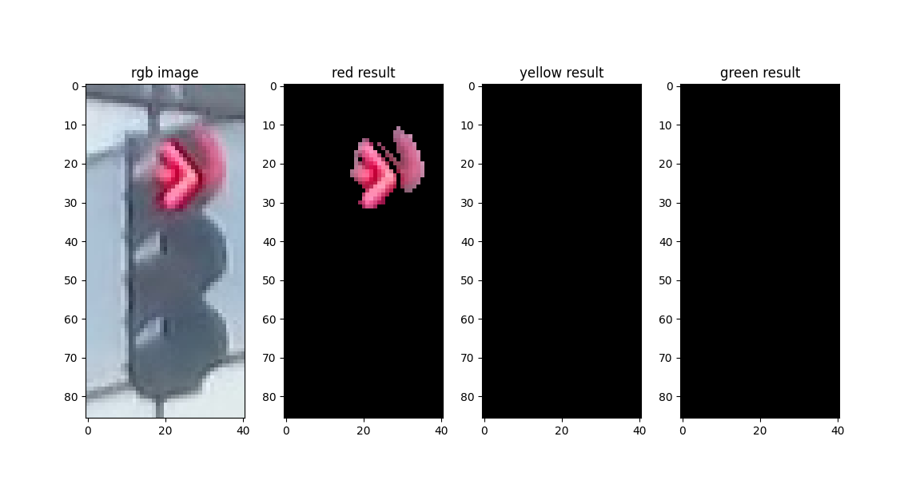
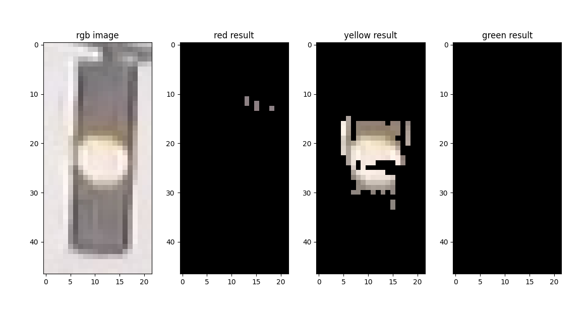
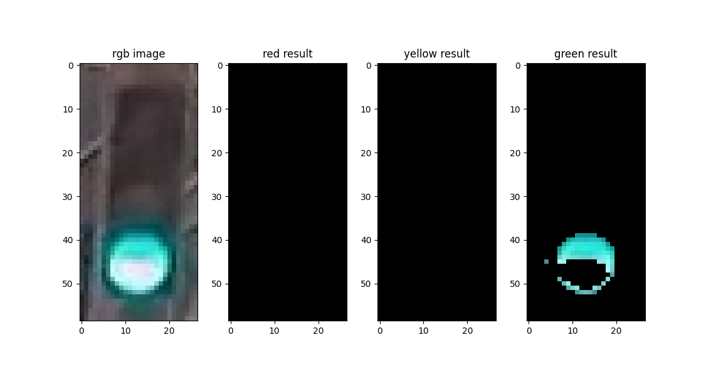
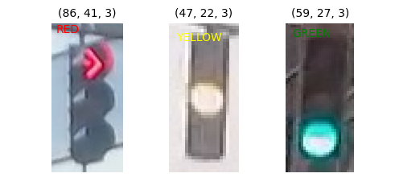

# 基于OpenCV的交通信号灯识别

> 本项目 fork 自[shawshany/traffic_light_classified](https://github.com/shawshany/traffic_light_classified)，保留其算法思想。做删去冗余部分，重写大部分代码，添加大量docstring，增强可扩展性与鲁棒性等处理。
> 
> 原版文档：[doc/README.md](doc/README.md)，原版代码：[src/Traffic-Light-Classfy.ipynb](src/Traffic-Light-Classfy.ipynb)。

## 简介

本文介绍了一种用于交通信号灯图像识别分类的算法：使用 OpenCV-Python，通过将图像转换至 HSV 色彩空间，使得其中的颜色更容易被分割，达到识别分类目的。仅运用图像处理方法，而没有使用机器学习方法。经简单调参，在测试集上可以达到98%以上的准确率。

本文算法代码与图像集已全部开源至 [Github - muziing/Traffic-Lights-Classification](https://github.com/muziing/Traffic-Lights-Classification)。

> 代码见本仓库 [src/traffic_light_classify](src/traffic_light_classfy) 目录, 测试图像集见 [src/traffic_light_images](src/traffic_light_images)。

## HSV色彩模型简介

常用的 RGB 色彩模型适合于显示系统，但颜色的改变会同时引起全部三个分量的变化，并不利于对颜色进行对比。而 HSV 色彩模型更接近于人类对彩色的感知经验，非常直观地表达颜色的色调、鲜艳程度与明暗程度，方便进行颜色的对比。

HSV 通过三个部分表示彩色图像：

- Hue - 色调、色相
- Saturation - 饱和度
- Value - 明度


以此圆柱体表示 HSV，圆柱体的横截面可以视为一个极坐标系，极坐标的极角表示 H,极轴长度表示 S,垂直于极坐标平面的高度方向则表示 V。不同的色相 H 表示不同的颜色，从 Hue=0° 表示红色开始，逆时针旋转一周，Hue=120° 表示绿色、Hue=240°表示蓝色等。以某个特定的 H 值，取圆柱体的半边横截面得到的矩形，水平方向表示 Saturation 饱和度，竖直方向表示 Value 明度。饱和度越高，颜色越接近光谱色，颜色越深；饱和度越低，颜色越接近白色越浅。明度越高，则颜色越明亮。

## 算法设计思想

有了 HSV 色彩模型，便容易实现交通信号灯图像识别分类了：色相通道可以独立地指定颜色；饱和度通道不受光照条件的影响，可以较好地识别对象边界。

对于交通信号灯图片，灯光部分的饱和度明显高于其他部分，有明显的对象边界。因此可以设计计算饱和度阈值，将低于该阈值的像素全部抹去，实现提取灯光部分的效果。



再加上特定颜色（红、黄、绿）、适当的明度范围，即可获得适用于该张图像的掩膜（mask）。经掩膜处理后，若图像的剩余部分仍有大量非空像素（图中非黑色部分），则可以判断为对应颜色的信号灯。






## 代码实现

本文介绍的算法相关代码已经全部开源至[Github - muziing/Traffic-Lights-Classification](https://github.com/muziing/Traffic-Lights-Classification)。

### 安装与导入第三方包

使用的所有第三方包列表及详细版本信息可以参考代码仓库中的 [requirements.txt](https://github.com/muziing/Traffic-Lights-Classification/blob/master/requirements.txt) 或 [poetry.lock](https://github.com/muziing/Traffic-Lights-Classification/blob/master/poetry.lock) 文件。

```python
import enum  # 定义枚举值类型，实现信号灯分类标签
import glob
import os.path  # 与glob组合使用，批处理图像文件路径

import cv2  # OpenCV, 用于图像处理
import numpy as np
from matplotlib import image as mpimg  # 用于读取图像文件
from matplotlib import pyplot as plt  # 用于可视化绘图
```

### 加载数据与添加标签

数据集来源已不可考，据称来自于[MIT自动驾驶课程](https://selfdrivingcars.mit.edu/)，包含1187张交通信号灯图像，其中有723张红灯、35张黄灯与429张绿灯。注意本文并未使用机器学习方法，而直接以原数据集中的训练集作为编写、调试、测试算法性能的全集。

首先定义分类标签，使用枚举值类型，包含红、黄、绿三种颜色与未识别。

```python
@enum.unique
class TrafficLightColor(enum.Enum):
    """
    交通灯颜色类型标签
    注意其value为文件系统中目录名称
    """

    RED = "red"
    YELLOW = "yellow"
    GREEN = "green"
    UNIDENTIFIED = "unidentified"
```

编写代码，遍历所有图像文件，读取图像数据，与其颜色标签构成二元元组，一起保存至列表中备用。

```python
def load_dataset(image_dir: str) -> list[tuple[np.ndarray, TrafficLightColor]]:
    """
    加载图像数据与添加标签
    :param image_dir: 图像目录
    :return: image 与 label
    """

    image_list = []

    # 遍历每个颜色文件夹
    for image_type in TrafficLightColor:
        file_lists = glob.glob(os.path.join(image_dir, image_type.value, "*"))
        for file in file_lists:
            try:
                image = mpimg.imread(file)
                image_list.append((image, image_type))
            except UnidentifiedImageError:
                # 若某文件无法作为图像被读取加载，则跳过
                continue

    return image_list

IMAGE_DIR_TRAINING: str = "../traffic_light_images/training"
IMAGE_LIST = load_dataset(IMAGE_DIR_TRAINING)
```



### 图像标准化处理

由于原始图像像素尺寸不一，可以考虑添加标准化代码，使其尺寸统一。将太大的图像缩小也有利于提高速度。

> 经实验，直接使用原始图像进行处理耗时24秒、识别错误20张图像；标注化至32\*64像素，耗时20秒、识别错误20张图像；标准化至32\*32像素，耗时10秒、识别错误21张图像；标准化至16*32像素，耗时5秒、识别错误24张图像。标准化图像尺寸（缩小）可以在精度牺牲很小的前提下明显提升运行速度，有一定意义。

```python
def standardize_image(
    image_list: list[tuple[np.ndarray, TrafficLightColor]],
    width: int,
    height: int,
) -> list[tuple[np.ndarray, TrafficLightColor]]:
    """
    将带有标签的图像列表输入逐个进行标准化处理，返回处理后的图像列表
    :param image_list: 图像与标签列表
    :param width: 标准图像宽度
    :param height: 标准图像高度
    :return: 标准化的图像列表
    """

    standard_list = []

    for item in image_list:
        image, label = item
        standardized_im = standardize_input(image, width, height)  # 标准化输入
        standard_list.append((standardized_im, label))

    return standard_list


def standardize_input(image: np.ndarray, width: int, height: int) -> np.ndarray:
    """
    辅助函数，将图像缩放到指定尺寸
    :param image: 原始图像
    :param width: 缩放后宽度
    :param height: 缩放后高度
    :return: 缩放后的图像
    """

    standard_image = cv2.resize(image, (width, height))
    return standard_image

# 标准化图像尺寸
STD_IMAGE_SIZE: tuple[int, int] = (32, 64)  # (width, height)
standardized_train_list = standardize_image(IMAGE_LIST, *STD_IMAGE_SIZE)
```

### HSV空间下的图像处理

`get_avg_saturation()` 函数用于计算图像中所有像素的平均饱和度，未来将以此为依据，设定 S 通道掩码的下界。而 `apply_mask()` 函数则为指定的颜色（范围）创建掩膜，并应用于原始图像。

```python
def get_avg_saturation(rgb_image: np.ndarray) -> float:
    """
    计算平均饱和度
    :param rgb_image: rgb图像
    :return: 平均饱和度
    """

    hsv_image = cv2.cvtColor(rgb_image, cv2.COLOR_RGB2HSV)
    s_channel = hsv_image[:, :, 1]
    return np.average(s_channel)

def apply_mask(
    rgb_image: np.ndarray, saturation_lower, value_lower, color_lower, color_upper
) -> np.ndarray:
    """
    对输入图像应用指定范围的掩膜，颜色由HSV中的上下边界确定
    :param rgb_image: 原始图像（RGB）
    :param saturation_lower: 饱和度下界
    :param value_lower: 明度下界
    :param color_lower: 颜色下界（HSV）
    :param color_upper: 颜色上界（HSV）
    :return: 应用掩膜后的图像
    """

    hsv_image = cv2.cvtColor(rgb_image, cv2.COLOR_RGB2HSV)
    lower = np.array([color_lower, saturation_lower, value_lower])
    upper = np.array([color_upper, 255, 255])
    red_mask = cv2.inRange(hsv_image, lower, upper)
    image_result = cv2.bitwise_and(rgb_image, rgb_image, mask=red_mask)

    return image_result
```

### 算法主函数

算法参数设定如下：

```python
# HSV阈值控制
SATURATION_LOWER_RATIO: float = 1.3  # 平均饱和度乘以此系数，作为饱和度下限，推荐值1.3
VALUE_LOWER: int = 140  # 明度下限
RED_LOWER: int = 150  # 红色色相下限
RED_UPPER: int = 180  # 红色色相上限
YELLOW_LOWER: int = 10  # 黄色色相下限
YELLOW_UPPER: int = 60  # 黄色色相上限
GREEN_LOWER: int = 70  # 绿色色相下限
GREEN_UPPER: int = 100  # 绿色色相上限
```

算法主函数：

```python
def traffic_light_classification(rgb_image: np.ndarray) -> TrafficLightColor:
    """
    算法主函数，返回输入的图像对应的信号灯颜色 \n
    算法参数（变量名全大写）需要在配置文件中设置 \n
    :param rgb_image: rgb空间下的单张图像数据
    :return: 信号灯颜色（枚举值）
    """

    avg_saturation = get_avg_saturation(rgb_image)  # 平均饱和度
    sat_low = int(avg_saturation * SATURATION_LOWER_RATIO)
    val_low = VALUE_LOWER

    red_result = apply_mask(rgb_image, sat_low, val_low, RED_LOWER, RED_UPPER)
    yellow_result = apply_mask(rgb_image, sat_low, val_low, YELLOW_LOWER, YELLOW_UPPER)
    green_result = apply_mask(rgb_image, sat_low, val_low, GREEN_LOWER, GREEN_UPPER)
    
    # 统计经各色掩膜处理后，剩余的非空像素数量，最多者则认为是该类图像
    sum_red = find_none_zero(red_result)
    sum_yellow = find_none_zero(yellow_result)
    sum_green = find_none_zero(green_result)
    sum_max = max(sum_red, sum_yellow, sum_green)

    if sum_max == 0:
        # 灯光部分像素与周围像素太接近，识别失败
        return TrafficLightColor.UNIDENTIFIED
    elif sum_max == sum_red:
        return TrafficLightColor.RED
    elif sum_max == sum_yellow:
        return TrafficLightColor.YELLOW
    elif sum_max == sum_green:
        return TrafficLightColor.GREEN
    else:
        return TrafficLightColor.UNIDENTIFIED

def find_none_zero(rgb_image: np.ndarray) -> int:
    """辅助函数，用于统计图像上的非空像素数"""
    rows, cols, _ = rgb_image.shape
    counter = 0
    for row in range(rows):
        for col in range(cols):
            pixels = rgb_image[row, col]
            if sum(pixels) != 0:
                counter = counter + 1

    return counter
```

### 运行测试

最后编写测试函数，将测试图片逐张传入算法函数，获得对应的预测标签，再与实际标签比对，得知算法是否准确。

```python
def get_misclassified_images(
    test_images,
) -> list[tuple[np.ndarray, TrafficLightColor, TrafficLightColor]]:
    """
    Constructs a list of misclassified images given a list of test images and their labels
    :param test_images: 用于测试的图像集
    :return: 分类错误的图像、预测标签、实际标签
    """
    
    misclassified_images_labels = []
    
    # 遍历所有测试图像，运行图像分类，对比预测标签与实际标签
    for image_set in test_images:
        image, true_label = image_set

        # 执行分类算法，获取预测标签
        predicted_label = traffic_light_classification(image)

        if predicted_label != true_label:
            # 若两种标签不匹配，则是分类错误
            misclassified_images_labels.append((image, predicted_label, true_label))

    return misclassified_images_labels

MISCLASSIFIED = get_misclassified_images(standardized_train_list)

# 准确度计算
total = len(standardized_train_list)
num_correct = total - len(MISCLASSIFIED)
accuracy = num_correct / total
print(
    f"Accuracy: {accuracy*100:.2f}%\n",
    f"Number of misclassified images = {len(MISCLASSIFIED)} out of {total}",
)
```

经测试，1187张图像中仅有21张分类错误，准确度为98.23%。

### 可视化绘图

还编写了数个可视化绘图函数，便于直观检查算法运行情况。

```python
"""
可视化地验证算法各部分函数运行情况
"""

import cv2
from config import *
from constants import TrafficLightColor
from hsv_process import apply_mask, get_avg_saturation
from load_data import load_dataset
from matplotlib import pyplot as plt


def viz_load_data(image_list, red_index, yellow_index, green_index) -> None:
    """
    数据加载部分的可视化
    """
    _, ax = plt.subplots(1, 3, figsize=(5, 2))

    # red
    red_img = image_list[red_index][0]
    ax[0].imshow(red_img)
    ax[0].annotate(image_list[red_index][1].name, xy=(2, 5), color="red", fontsize="10")
    ax[0].axis("off")
    ax[0].set_title(red_img.shape, fontsize=10)

    # yellow
    yellow_img = image_list[yellow_index][0]
    plt.imshow(yellow_img)
    ax[1].imshow(yellow_img)
    ax[1].annotate(
        image_list[yellow_index][1].name, xy=(2, 5), color="yellow", fontsize="10"
    )
    ax[1].axis("off")
    ax[1].set_title(yellow_img.shape, fontsize=10)

    # green
    green_img = image_list[green_index][0]
    plt.imshow(green_img)
    ax[2].imshow(green_img)
    ax[2].annotate(
        image_list[green_index][1].name, xy=(2, 5), color="green", fontsize="10"
    )
    ax[2].axis("off")
    ax[2].set_title(green_img.shape, fontsize=10)
    plt.show()


def viz_hsv(image_list, image_num: int = 0) -> None:
    """
    将图像分解到hsv三通道的可视化
    """

    test_im, test_label = image_list[image_num]
    # convert to hsv
    hsv = cv2.cvtColor(test_im, cv2.COLOR_RGB2HSV)
    # Print image label
    h = hsv[:, :, 0]
    s = hsv[:, :, 1]
    v = hsv[:, :, 2]
    # Plot the original image and the three channels
    _, ax = plt.subplots(1, 4, figsize=(20, 10))
    ax[0].set_title("Standardized image")
    ax[0].imshow(test_im)
    ax[1].set_title("H channel")
    ax[1].imshow(h, cmap="gray")
    ax[2].set_title("S channel")
    ax[2].imshow(s, cmap="gray")
    ax[3].set_title("V channel")
    ax[3].imshow(v, cmap="gray")
    plt.show()


def viz_mask(rgb_image) -> None:
    """
    主算法中掩码作用后的可视化
    """

    hsv_image = cv2.cvtColor(rgb_image, cv2.COLOR_RGB2HSV)

    avg_saturation = get_avg_saturation(rgb_image)
    sat_low = int(avg_saturation * SATURATION_LOWER_RATIO)
    val_low = VALUE_LOWER

    red_result = apply_mask(rgb_image, sat_low, val_low, RED_LOWER, RED_UPPER)
    yellow_result = apply_mask(rgb_image, sat_low, val_low, YELLOW_LOWER, YELLOW_UPPER)
    green_result = apply_mask(rgb_image, sat_low, val_low, GREEN_LOWER, GREEN_UPPER)

    _, ax = plt.subplots(1, 4, figsize=(20, 10))
    ax[0].set_title("rgb image")
    ax[0].imshow(rgb_image)
    ax[1].set_title("red result")
    ax[1].imshow(red_result)
    ax[2].set_title("yellow result")
    ax[2].imshow(yellow_result)
    ax[3].set_title("green result")
    ax[3].imshow(green_result)
    plt.show()


if __name__ == "__main__":
    IMAGE_LIST = load_dataset(IMAGE_DIR_TRAINING)
    img_red = IMAGE_LIST[7][0]
    img_yellow = IMAGE_LIST[730][0]
    img_green = IMAGE_LIST[800][0]
    img_test = [
        (img_red, TrafficLightColor.RED),
        (img_yellow, TrafficLightColor.YELLOW),
        (img_green, TrafficLightColor.GREEN),
    ]

    viz_load_data(IMAGE_LIST, 7, 730, 800)
    viz_hsv(IMAGE_LIST, 7)
    for img in img_test:
        viz_mask(img[0])

```

## 总结

使用 OpenCV 进行图像处理，将图像转至 HSV 色彩空间，运用适当的掩膜提取出关注部分，比较关注部分非空像素值的个数，最终实现了交通信号灯识别分类算法。该算法实现简单，运算速度快，经简单调参后可以达到98%以上的正确率，效果较好。

## 参考资料

- [wiki - HSL and HSV](https://www.wikiwand.com/en/HSL%20and%20HSV)
